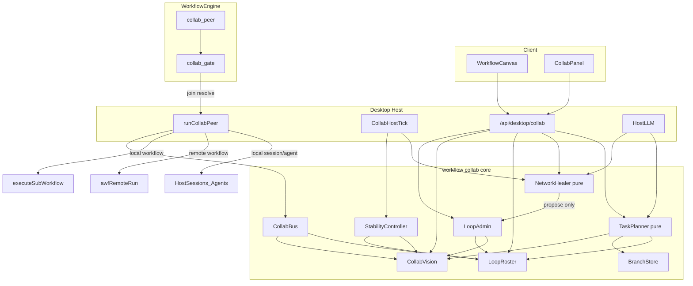

# 跨会话工作流协作 / 联调（Collab Loop）

> 日期：2026-09-26 · **本仓库正式交付文档**（自 Cursor plan 完善后入库）  
> 概要：跨会话协作 Loop（Desktop 主战场）+ AWF 仅 `remote.workflow` 后端；含 AWF 对齐契约。真 ASP wire 留待 V2。  
> AWF 交叉契约：sibling 仓 `ai-workflow-dev` 的 `docs/COLLAB_BRIDGE.md`（以该仓为准）  
> 客户端既有集成：[`awf-client-plan.md`](./awf-client-plan.md)

> **权威性**：以实现与排期为准的唯一正文；勿与过期 Cursor/本地 plan 并行维护。相关产品计划：[`time-master-plan.md`](./time-master-plan.md)（时间轴；Collab handoff 见该文 V2）。

## 实施 todos（V1）

| ID | 内容 | 状态 |
|----|------|------|
| collab-core | 纯 Node collab 内核（JID/Bus/Vision/Roster/CapToken/Membership）+ 单测；与 run 内 shared 黑板命名隔离 | completed |
| collab-engine | `StepType.collab_peer` + validate/executor + 本地 collab gate（复用 resolveGate；非 AWF gate）+ Desktop hook | completed |
| collab-stability | StabilityController（heartbeat/offline/rejoin/目标 orphan\|改派）+ Host tick | completed |
| collab-admin | LoopAdmin + `/api/desktop/collab` 控制面（snapshot/invite/kick/reassign/pause/transfer） | completed |
| collab-ai-heal | NetworkHealer（观察→HealPlan→待批 apply；默认不自动执行） | completed |
| collab-task-plan | TaskPlanner（evaluate/assign/invite/spawnBranch）+ BranchRecord 持久化 | completed |
| collab-template-ui | problem-loop 模板 + 协作面板五 Tab + palette/inspector + zh/en/ja/ko | completed |
| collab-remote-awf | P7 Remote lifecycle：`auto_approve:false` + 轮询终态 + resolveGate(runnerUUID)；禁 sync `collab_peer`；session/agent remote 拒绝 | completed |
| collab-sync | beta→desktop 同步 + `check:desktop-variants` | completed |

## 决策（本版锁定）

- **ASP 用法**：V1 实现 **ASP 形协调层**（JID、Message/Presence/IQ、CapabilityToken、会话共享上下文），字段命名对齐 sibling 仓 `ai-agent-protocol` 的 proto；**不**依赖 Rust ASP Server / Python SDK（无 TS SDK）。预留 `AspBridge`，V2 接 TCP/Protobuf。
- **节点模型**：单一新步骤 `collab_peer`，用 `peer.kind` 区分；本地先通；远程仅 `workflow` 走 AWF `remoteRun`；`session`/`agent` 的 `remote.`* **显式拒绝**（清晰错误，不做假远程）。
- **开放自稳**：默认开放成员制；单 peer 失联不整环失败（除非 quorum）；规则自愈与 AI 自愈分层。
- **控制面**：每 Loop 唯一 Admin；高危动作可再经 workflow `approval` 或 collab 待批队列。
- **任务树**：Admin（可 AI）拆任务 → 分配 / 邀请 / `spawnBranch`；父 Loop = 控制面，分支 = 执行面。
- **不做上游改动**：不改 `deepseek-harness/`；问题 loop = 内置模板 + Host 编排（类 RSI 风格，**不**复用 AWF `/api/rsi`）。
- **AWF 边界**：Collab 状态机/Roster/CollabVision/CapToken **不进** AWF DB；平台只托管「已同步的普通工作流」执行。契约见下文「AWF 对齐」。

## AWF 对齐（2026-09-26 修订）

> 交叉文档（AWF 仓）：sibling `ai-workflow-dev/docs/COLLAB_BRIDGE.md`

### 双端职责

| | Desktop Host | AWF 平台 |
|--|--------------|----------|
| CollabLoop / Bus / Vision / CapToken / Healer / TaskPlanner | 拥有 | 不实现 |
| `collab_peer` / 本地 collab gate / Host tick | 拥有 | 无此 StepType |
| sync / publish / `POST .../runs` | 调用方 | 拥有定义与托管执行 |
| 平台 `approval` gate | 仅 JWT **属主** resolve | 拥有 |
| Tunnel / Executor | 可选客户端 | **反向**通道，≠ remoteRun |
| 真 ASP / remote session·agent | V2 AspBridge | V2+ 才可能联邦 |

### remote.workflow 生命周期（P7 锁定）

```
1) 若未上云：sync/validate → sync/push（YAML 不得含 collab_peer）→ 可选 publish
2) createRun(workflowId, params, auto_approve: false)   // 必须显式 false（平台缺省 true）
3) Host 轮询至 finished | failed | waiting_gate（用 runner UUID；勿与 run_records 数字 id 混用）
4) waiting_gate → POST .../runs/{runnerUUID}/gates/{token}（仅 AWF JWT 属主）
5) CapToken / LoopAdmin 只控制「是否允许发起 remoteRun」，不能代替平台 gate
```

### 硬约束

- **禁止**把含 `collab_peer` / `requires: ['collab']` 的图 sync 到 AWF；上云前 strip 或拆「本地编排图 + 云端纯净子图」。
- Desktop `engineCapabilities.features` 含 `'collab'`；平台 capabilities **不**声明 collab（desktop-only）。
- 嵌套预算：本地 `spawnBranch` / `executeSubWorkflow` → Desktop `maxNestedDepth`/`maxActiveRuns`；AWF 内部 `sub_workflow` → 平台预算，**不计入** Host 并发。云端子图 **禁止**含 `approval`（平台子流程遇门会失败）。
- **不做**（V1）：用 Tunnel/Executor 当 remote.workflow；把 bloom/RSI/Review 当 Collab 运行时；共享身份/委托 gate（→ AWF 仓 A4，可选后续）。

### 与 AWF 现有模式划清

| AWF 已有 | 与 Collab |
|----------|-----------|
| bloom | 多模型 fanout，非多 agent Loop |
| RSI `/api/rsi` | 自改进迭代；problem-loop **仅风格类比** |
| Review committee | 发布前评审 |
| community / groups | SNS |
| executor / tunnel | 平台→桌面，与 Host→平台 remoteRun **反向** |

### AWF 仓配套（不挡 Desktop V1；并行）

- **A1** `awf-4h3` ✅ 稳定按 runner UUID 查单 run；文档澄清双 ID  
- **A2** `awf-uu4` ✅ CreateRun 可选 `external_loop_id` / `external_branch_id`（params 或列）+ telemetry  
- **A3** `awf-t9e` ✅ capabilities / sync：未知或 desktop-only feature warn/strip  
- **A4**（延期）`awf-kvb` 委托 gate token  
- **A5**（延期）`awf-2ib` 身份联邦 / remote session·agent  

## 包边界与职责（自洽分层）


| 层            | 包 / 路径                                                               | 职责                                                                                                                                          |
| ------------ | -------------------------------------------------------------------- | ------------------------------------------------------------------------------------------------------------------------------------------- |
| 纯 Node 内核    | `[dsh-plugin-workflow/src/collab/](../dsh-plugin-workflow/src/collab/)` | JID、envelope、Bus（进程内）、Vision/Roster/Admin/Branch 类型与磁盘 schema、Membership 状态机、CapToken HMAC、Stability 规则、HealPlan/TaskPlan **校验与 apply 纯函数** |
| 引擎接入         | `[dsh-plugin-workflow/src/engine/](../dsh-plugin-workflow/src/engine/)` | `StepType.CollabPeer`、`validateStep`、`runStep` → hook、**collab gate**（等 join）、`engineCapabilities.features` 增 `'collab'`                    |
| Desktop Host | `[dsh-plugin-desktop-beta/src/](../dsh-plugin-desktop-beta/src/)`       | HTTP `/api/desktop/collab`、Host tick（Stability/Healer）、LLM（evaluate/heal）、session/agent/workflow 执行 hook、AWF bridge、UI                      |
| 镜像           | `dsh-plugin-desktop/`                                                | P8 同步；变体差异保留                                                                                                                                |


命名隔离：引擎已有 run 内黑板 [`shared-vision.ts`](../dsh-plugin-workflow/src/engine/shared-vision.ts)（`Run.shared`）。跨 session 协作视野一律称 **CollabVision**（文件 `vision.json`），避免与 `shared`/`vision_append` 混淆。

## 现状锚点

- `StepType`：`script|task|llm|approval|sub_workflow` — `[models.ts](../dsh-plugin-workflow/src/engine/models.ts)`
- Gate 等待：`Approval` + `resolveGate` + `isWaitingOnlyOnGates` — `[coordinator.ts](../dsh-plugin-workflow/src/engine/coordinator.ts)` / `[plugin.ts](../dsh-plugin-workflow/src/plugin.ts)`（**开放槽 wait 锁定复用此路径**）
- 嵌套：`maxNestedDepth` 默认 **3**，`maxActiveRuns` 默认 **4**
- Desktop hooks：`[desktop-workflow-executor.ts](../dsh-plugin-desktop-beta/src/desktop-workflow-executor.ts)`（扩展 `runCollabPeer`）
- LLM：`designWorkflowWithLlm` / `runRsiReview` 同路径
- AWF：`[desktop-awf-bridge.ts](../dsh-plugin-desktop-beta/src/desktop-awf-bridge.ts)` `remoteRun`
- Host 定时器范式：`[time-master-host.ts](../dsh-plugin-desktop-beta/src/time-master-host.ts)`（`ctx.effect` + `setInterval`；Collab 用更短间隔；产品计划见 [`time-master-plan.md`](./time-master-plan.md)）
- API 范式：`*-contract.ts` + `*-route.ts` + `webServer.register` exact path
- ASP：JID `node@domain[/resource]`；Presence `ONLINE|AWAY|DND|XA|OFFLINE`；无 TS SDK




## 身份与寻址（JID）

V1 采用 **ASP 形 JID**，本地域固定 `desktop.local`：


| 实体            | bare / full 例                           |
| ------------- | --------------------------------------- |
| Admin（本机控制面）  | `admin@desktop.local/control`           |
| Session       | `session@desktop.local/<sessionId>`     |
| Agent         | `agent@desktop.local/<agentId>`         |
| Workflow（本地名） | `workflow@desktop.local/<workflowName>` |
| Workflow（AWF） | `awf@desktop.local/<awfWorkflowId>`     |
| 开放槽占位（未绑定）    | 无 jid；roster 用 `slot` 表示 Vacant         |


`peer.jid` 存 full 或 bare；校验解析 `node`/`domain`/`resource`。禁止再发明 `local.session:` 前缀（与早期草稿脱钩）。

## 数据模型

### 1. Loop 与 Run 的关系

```ts
interface CollabLoop {
  loopId: string                 // 稳定 id，≠ runId
  workflowName: string
  rootRunId?: string             // 当前/最近绑定的引擎 Run
  status: 'idle' | 'running' | 'waiting' | 'paused' | 'closed'
  createdAt: string
  closedAt?: string
}
```

- `loop.start`：分配 `loopId`，写 `$DSH_HOME/collab/<loopId>/`（`loop.json` + vision + roster + admin），再启动（或附着）workflow run，把 `loopId` 写入 run 元数据 / 上下文。
- 一个 Loop 生命周期内可有多次 root run（失败重跑）；**roster/vision 按 loopId 持久化**，不随单次 run 清零（除非 `loop.close`）。
- 进程重启：`isWaitingOnlyOnGates` 的 collab gate 可恢复；Stability tick 重启后继续。

磁盘布局：

```
$DSH_HOME/collab/
  secret                        # 全局 HMAC（0600）；非 per-loop
  <loopId>/
    loop.json
    admin.json
    roster.json
    vision.json
    branches/<branchId>.yaml    # 动态分支定义
    branches/index.json         # BranchRecord[]
    heal/pending.json           # 待批 HealPlan
    plan/latest.json            # 最近 TaskPlan
```

### 2. 步骤 `collab_peer`

扩展 `[StepType](../dsh-plugin-workflow/src/engine/models.ts)`：

```ts
// type: 'collab_peer'
peer: {
  kind: 'session' | 'agent' | 'workflow'
  jid?: string              // 静态绑定；开放槽可省略
  role?: string
  goals?: string[]          // 初始目标 id 列表（启动时写入 CollabVision）
  grant?: string[]          // 如 vision:read, vision:write, bus:send
  open?: boolean            // 默认 true
  slot?: string             // 开放槽 id；open 时建议必填
  quorum?: number           // 默认 1
  heartbeatMs?: number      // 默认 15_000
  offlineGraceMs?: number   // 默认 45_000
  rejoin?: 'resume' | 'replace' | 'reject'  // 默认 resume
}
```

校验：

- `open === false` ⇒ `jid` 必填；不建 Vacant 槽。
- `open === true` ⇒ 需要 `slot`（+ 建议 `role`）；运行时 join 绑定 jid。
- `kind === 'workflow'` 且 jid node=`awf` ⇒ 需 AWF 已配置，否则 validate/执行期失败。
- `kind` 为 session/agent 且 jid domain 非 `desktop.local` 或 node 暗示 remote ⇒ **拒绝**。

### 3. Roster / Presence（生命周期 vs ASP Show）

```ts
type MemberLifecycle = 'vacant' | 'joining' | 'active' | 'left'
// ASP Show 仅在 active 时有意义：
type AspShow = 'ONLINE' | 'AWAY' | 'DND' | 'XA' | 'OFFLINE'

interface RosterMember {
  jid?: string              // vacant 时缺省
  kind: 'session' | 'agent' | 'workflow'
  slot?: string
  role?: string
  lifecycle: MemberLifecycle
  show?: AspShow            // pause → DND；grace soft miss → AWAY；超时 → OFFLINE
  lastSeenAt?: string
  joinedAt?: string
  leftAt?: string
  epoch: number             // join/rejoin 成功 +1
  boundStepId?: string
  paused?: boolean          // Admin pause；与 show=DND 同步
}

interface LoopRoster {
  loopId: string
  members: RosterMember[]
  updatedAt: string
}
```

状态机：Vacant → Joining → Active(ONLINE) ↔ AWAY；Active/AWAY → OFFLINE（grace）；leave/kick/replace → Left →（slot_freed）Vacant；rejoin(resume) 自 OFFLINE→Joining。

### 4. CollabVision

```ts
interface CollabVision {
  loopId: string
  threadId: string          // 对齐 ASP Message.thread_id
  goals: {
    id: string
    title: string
    status: 'open' | 'done' | 'blocked' | 'orphaned'
    ownerJid?: string
    slot?: string
    acceptance?: string[]
    branchId?: string       // 若由分支执行
  }[]
  facts: { id: string; text: string; sourceJid: string; at: string }[]
  artifacts: { id: string; pathOrUri: string; kind: string; sourceJid: string }[]
  updatedAt: string
}
```

### 5. CapToken

对齐 ASP `CapabilityToken`：`subject_jid`, `permissions[]`, `issued_at`, `expires_at`, `signature`；V1 本机 HMAC（`$DSH_HOME/collab/secret`）。另绑 `loopId` + `epoch`（epoch 不匹配即失效）。

- join 签发；leave / kick / offline 吊销当前 epoch。
- 写 vision / 执行 peer 动作前验 token；失败 → approval 或拒绝。
- 不做完整沙箱。

### 6. CollabBus

进程内 pub/sub；信封对齐 `AgentStreamMessage`：

```ts
{ id, from_jid, to_jid, timestamp, payload: message | presence | iq }
```

IQ：`vision.get|append`、`goal.claim|release`、`membership.*`、`step.result`、`branch.complete`。V2：`AspBridge.send(envelope)`。

### 7. LoopAdmin

```ts
interface LoopAdmin {
  loopId: string
  adminJid: string          // 默认 admin@desktop.local/control
  // V1 不做副管细粒度；deputies 仅只读观察（可选）
  deputies?: string[]
  control: {
    canInvite: boolean
    canKick: boolean
    canReassignGoals: boolean
    canSpawnBranch: boolean
    canPausePeers: boolean
    canHealAuto: boolean    // 默认 false
  }
  healerIntervalMs?: number // 默认 60_000；0 = 关
}
```

**鉴权（V1）**：`/api/desktop/collab` 仅 loopback（同现有 desktop API）；写操作另要求 body `actorJid === adminJid`（或 grant 含 `admin:control`）。非 Admin 只读 `network.snapshot` / vision 读。不引入跨网认证。

### 8. BranchRecord

```ts
interface BranchRecord {
  branchId: string
  loopId: string
  goalIds: string[]
  workflowName: string      // 存盘名 branches/<branchId>.yaml 对应
  parentLoopId: string
  runId?: string
  status: 'draft' | 'running' | 'done' | 'failed' | 'cancelled'
  createdAt: string
}
```

深度：`spawnBranch` 计入 `maxNestedDepth`；超限拒绝。并发：计入 `maxActiveRuns`；满则分支排队或返回明确错误（不静默丢）。

## 开放槽等待（锁定机制）

不另造并行等待运行时。`collab_peer` + `open` 且无绑定成员时：

1. 引擎为该步创建 **collab gate**（同 Approval gate 结构：`token`、`pass` 语义扩展为 `joined`）。
2. Coordinator 对未 resolve 的 collab gate **不 dispatch**（与 Approval 相同 `continue`）。
3. `membership.join` 成功且绑定 `boundStepId` → Host 调 `resolveGate` → 续跑 → `runCollabPeer`。
4. Quorum 不足：依赖该 slot 组的下游步同样 gate 阻塞；UI「等待成员」。
5. Orphan 恢复走现有 `isWaitingOnlyOnGates`。

静态节点（`open: false`）：无 Vacant；仅同 jid reconnect(resume)；失败走 `on_failure`。

## StabilityController（规则 / 硬）

Host：`ctx.effect` + `setInterval(~5s)` → `StabilityController.tick(loopId)`（仅 `status` 为 running/waiting 的 loop）。


| 事件           | 行为                                                                                          |
| ------------ | ------------------------------------------------------------------------------------------- |
| join         | 校验 slot/role/容量；roster；Presence ONLINE；发 token；resolve collab gate；可选认领 orphaned/open goals |
| leave / kick | goals → orphaned（或同 role 在线改派）；吊销 token；lifecycle=left                                      |
| heartbeat    | soft miss → AWAY；超 `offlineGraceMs` → OFFLINE + goals orphaned                              |
| rejoin       | resume：升 epoch、重签、认领 orphaned；replace：新 jid 占 slot，旧 left                                   |
| invite（V1）   | **本机**：确保 Vacant 槽存在（可动态加 slot 成员行）+ UI/Bus 广播邀请；**不是**跨网服务发现                               |


规则层 **不**调用 LLM；不执行 isolate/spawn。

## NetworkHealer（AI / 软）

与 Stability **并列**，不互相驱动状态机；Healer **只提议**，经 Admin `healer.apply` 落到与控制面相同的 API（reassign/invite/pause…）。

```ts
type HealAction =
  | { type: 'nudge_rejoin'; jid: string }
  | { type: 'reassign_goal'; goalId: string; toJid?: string; toSlot?: string }
  | { type: 'invite'; slot: string; role: string; reason: string }
  | { type: 'isolate'; jid: string; reason: string }       // pause + 不再派新任务
  | { type: 'spawn_repair_branch'; goalIds: string[]; hint: string }
  | { type: 'escalate_admin'; message: string }

interface HealPlan {
  loopId: string
  at: string
  healthScore: number
  findings: { jid?: string; code: string; detail: string; severity: 'info'|'warn'|'crit' }[]
  actions: HealAction[]
}
```

- 默认写入 `heal/pending.json` + UI「待批」；`canHealAuto=false`。
- `canHealAuto=true`：仅自动低危（nudge_rejoin、reassign_goal、invite）；isolate / spawn_repair_branch / escalate 仍要人工。
- 触发：Admin 手动、Stability 产生 OFFLINE/orphaned 后防抖一次、或 `healerIntervalMs`。
- LLM 输出必须经纯函数 schema 校验；非法 plan 丢弃并 escalate。

## TaskPlanner

```ts
interface TaskPlan {
  loopId: string
  rootGoal: string
  subtasks: {
    id: string
    title: string
    acceptance?: string[]
    dependsOn?: string[]
    preferredRole?: string
    assignToJid?: string
    inviteSlot?: string
    branchHint?: string
  }[]
}
```

下发规则（互斥优先序，写进实现与单测）：

1. 有 `assignToJid` 且成员 active → `goals.reassign` / claim。
2. 否则有 `inviteSlot` → `membership.invite`（必要时建 Vacant 槽）。
3. 否则有 `branchHint` → `plan.spawnBranch`（YAML：模板骨架 + Host LLM 填步骤 → `branches/<id>.yaml` → 以 `sub_workflow` 或 `collab_peer(kind:workflow)` 挂到父图 / 由 Host 另启子 run 并写 BranchRecord）。
4. 否则只写入 goal=`open`，等待 Admin。

环检测：`dependsOn` DAG；spawn 使用现有 `WORKFLOW_STACK_PARAM` / `executeSubWorkflow` 环检。

## 引擎与 Desktop hook

1. `runStep` → `collab_peer` → 若需等人则已在 gate 层返回等待；gate 通过后 `hooks.runCollabPeer`。
2. Desktop `runCollabPeer`：
  - session/agent：本机 Host 执行面；全程 Presence + heartbeat；**禁止** remote.*。
  - workflow + `workflow@…`：`executeSubWorkflow`（吃 Desktop 嵌套/并发预算）。
  - workflow + `awf@…`：完整 remote 生命周期（见「AWF 对齐」：`auto_approve:false` + 轮询 + 属主 resolveGate）；P1 可先返回未实现错误。
3. 失联：abort/挂起子 run；goals orphaned；remote 记 AWF runner UUID（不假完成）。
4. `branch.complete` IQ → 更新 CollabVision goal + BranchRecord。
5. 开放槽 **collab gate** 仅阻塞**本地**引擎；与 AWF `waiting_gate` 无关，勿混用 resolve 路径。

## HTTP 契约（单一入口）

`POST /api/desktop/collab`（contract/route 同 time-master / workflow 范式）。Ops：


| 组      | ops                                                                             |
| ------ | ------------------------------------------------------------------------------- |
| Loop   | `loop.start` `loop.close` `loop.get`                                            |
| Vision | `vision.get` `vision.append`                                                    |
| Roster | `roster.get` `membership.join` `leave` `heartbeat` `rejoin` `invite` `kick`     |
| Admin  | `network.snapshot` `goals.reassign` `peer.pause` `peer.resume` `admin.transfer` |
| Heal   | `healer.evaluate` `healer.apply` `healer.pending`                               |
| Plan   | `plan.evaluate` `plan.assign` `plan.spawnBranch` `plan.get`                     |
| Bus    | `bus.send`（调试/高级）                                                               |
| Grants | `grants.issue`                                                                  |


`network.snapshot` = loop + roster + vision + branches + pending heal + healthScore（若有）。

## UI（beta）

- Palette / Inspector / blank step / styles / design prompt / `WorkflowStepType` 同步五元组→六元组。
- 画布：presence 色点；分支入口。
- 协作面板 Tab：**Vision | Roster | Network | Heal | Task Plan**。
- Locales：zh/en/ja/ko。

## 落地顺序

- **P0** 内核类型 + 磁盘 + Bus + Membership/CapToken + 单测  
- **P1** `collab_peer` + collab gate + Desktop hook（local only）  
- **P2** StabilityHost tick  
- **P3** LoopAdmin HTTP 控制面  
- **P4** NetworkHealer  
- **P5** TaskPlanner + BranchStore  
- **P6** 模板 + UI + locales（可选：AWF `workflow-templates` 仅作内容种子，非 Loop 运行时）  
- **P7** AWF remote.workflow **完整生命周期**（对齐节；可与 AWF A1–A3 并行）  
- **P8** beta→desktop + `check:desktop-variants`  
- **V2** AspBridge、remote session/agent、DID、deputies 细权、heal auto 默认策略可开；依赖 AWF A4/A5 时再开双端

## 明确不做（V1）

- 改 `deepseek-harness/`
- 真 ASP TCP/TLS/Protobuf 客户端
- 远程 session/agent
- 新执行沙箱 / 跨 loop 服务发现市场
- 副管细粒度授权
- 破坏性自愈默认自动执行
- 与 run 内 `Run.shared` 合并为同一存储
- 把 Collab 状态机搬进 AWF；用 Tunnel/Executor 冒充 remoteRun；sync 含 `collab_peer` 的 YAML

## 验证

- 单测：join→OFFLINE→orphaned→rejoin；leave/replace；quorum gate 不假完成  
- 单测：非 Admin 写拒绝；kick/reassign  
- 单测：HealPlan schema；auto 关闭不执行；低危 auto 白名单  
- 单测：TaskPlan 优先序 assign>invite>branch；spawn 深度/环拒绝  
- 单测：JID 解析；epoch 吊销后旧 token 失效  
- 单测：sync 预检拒绝/剥离 `collab_peer`；remoteRun 路径强制 `auto_approve:false`  
- 手工：拆大任务 → 两 agent + 一本地分支 → 一 `awf@` 远程 → kick → AI 待批自愈 → 重联完成；远程门由本机 JWT 属主 resolve

## 评审修订摘要（相对前稿）

- 统一 ASP 形 JID，废弃 `local.session:` 前缀  
- Presence：lifecycle 与 ASP Show 分离；pause=DND  
- 开放槽 wait **锁定**复用 Approval/gate/`resolveGate`（**仅本地引擎**）  
- 明确 Loop≠Run、磁盘布局、BranchRecord、pending heal/plan  
- 包边界：纯 Node 校验/状态 vs Desktop LLM/HTTP/执行  
- CollabVision 与引擎 `shared-vision` 命名隔离  
- Healer 与 Stability 并列（提议→同一控制面 API），去掉 Healer→Stab 误导边  
- V1 invite = 本机槽+UI，非跨网发现；deputies 只读  
- 补齐单一 HTTP op 表、maxNestedDepth/maxActiveRuns 行为、鉴权（loopback+actorJid）  
- **+ AWF 对齐节**：remote 生命周期、禁 sync collab、双 ID、预算切开、与 bloom/RSI/tunnel 划界、A1–A5 配套

