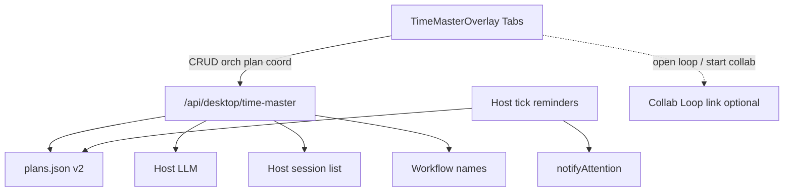

# 时间大师（V1 登记提醒 + V2 编排 / 项目规划 / 跨会话协调）

> 日期：2026-09-26 · **本仓库正式交付文档**（自 Cursor plan 入库）  
> **权威性**：以实现与排期为准；勿与过期 Cursor/本地 plan 并行维护。  
> 相关：[`collab-loop-plan.md`](./collab-loop-plan.md)（执行面；本计划仅时间轴 + handoff）

## 实施 todos

| ID | 内容 | 状态 |
|----|------|------|
| tm-core | time-master 类型、plans.json 读写、提醒键计算、启发式模板 | completed |
| tm-host | Host HTTP CRUD + contextSnapshot + aiSuggest + 定时 notifyAttention | completed |
| tm-ui | 侧栏入口 + overlay 列表/表单/AI 填充 + locale/styles | completed |
| tm-tests-sync | 单测 + beta→desktop 同步 + check:desktop-variants | completed |
| tm-v2-usage-orch | UsageSchedule 模型 + aiOrchestrateUsage（错开/配额窗口）+ UI 编排视图 | completed |
| tm-v2-project-plan | ProjectPlan / TaskItem + aiPlanProject + 截止日期提醒复用 | completed |
| tm-v2-coord | 多任务/跨会话绑定（session/workflow 引用）+ 协调面板 + 冲突检测 | completed |
| tm-v2-tests-sync | V2 单测 + beta→desktop + check:desktop-variants + locales | completed |
| tm-v2-collab-handoff | Collab 探测 + handoff 启动 Loop + 任务绑 loopId（V2.3） | completed |

## 现状（V1 已落地，勿回退）

- 手工登记 `TokenPlan`；`aiSuggest` 按 Models/工作流上下文预填；Host 按 `expiresAt` + `remindDays` → `notifyAttention`
- 路径：[`../dsh-plugin-desktop-beta/src/time-master/`](../dsh-plugin-desktop-beta/src/time-master/)、[`time-master-host.ts`](../dsh-plugin-desktop-beta/src/time-master-host.ts)、[`TimeMasterOverlay.tsx`](../dsh-plugin-desktop-beta/src/client/TimeMasterOverlay.tsx)
- API：`POST /api/desktop/time-master` — `list|upsert|delete|contextSnapshot|aiSuggest`
- 存储：`$DSH_HOME/time-master/plans.json`（version 1）

## V1 决策（已锁定）

- **数据来源**：手工登记为主；不对接官方账单 API。
- **AI 辅助**：一键根据本机 Models / 工作流提供方上下文预填；用户确认后写入。
- **提醒**：按套餐 `expiresAt` 到期前 `notifyAttention`；默认 remindDays `[7,3,1,0]`。

## V2 决策（本版锁定）

- **时间大师 = 时间轴与计划面**：管「何时用哪套餐、项目任务何时做、多任务如何错开」；**不**变成 Collab 执行引擎（agent 网络 / Bus / heal 仍归 Collab Loop）。
- **AI 编排使用计划**：基于已登记 `TokenPlan` + hint + contextSnapshot，生成 **UsageSchedule**；用户确认后落盘。
- **项目任务规划**：新增 **ProjectPlan**；`aiPlanProject` 结构化草稿；任务到期复用同一提醒管道。
- **多任务 / 跨会话协调**：任务可绑定 `sessionId` / `workflowName` / `loopId?`；冲突检测 + AI 改期建议；执行协作仅 **Collab handoff**（打开/创建 Loop），不内嵌 CollabBus。
- **存储演进**：`plans.json` → version **2**（增 `schedules` / `projects`；读 v1 自动升级）；0600。
- **提醒统一**：`remindersSent` 键前缀 `plan:` / `task:` / `schedule:`。

## V2 数据模型

```ts
interface UsageSchedule {
  id: string
  name: string
  horizonDays: number             // 默认 30
  items: {
    planId: string
    role: 'primary' | 'backup' | 'burst' | 'idle'
    windowStart: string           // YYYY-MM-DD
    windowEnd: string
    dailyBudgetHint?: string
    notes?: string
  }[]
  rationale?: string
  createdAt: string
  updatedAt: string
}

interface ProjectTask {
  id: string
  title: string
  status: 'todo' | 'doing' | 'blocked' | 'done'
  dueAt?: string
  remindDays?: number[]           // 缺省 [3,1,0]
  estimateHours?: number
  dependsOn?: string[]
  sessionId?: string
  workflowName?: string
  loopId?: string
  planId?: string
  notes?: string
}

interface ProjectPlan {
  id: string
  title: string
  goal: string
  status: 'active' | 'paused' | 'done'
  tasks: ProjectTask[]
  createdAt: string
  updatedAt: string
}

interface CoordConflict {
  code: 'due_overlap' | 'session_overload' | 'plan_window_miss'
  taskIds: string[]
  detail: string
}

interface TimeMasterStoreV2 {
  version: 2
  plans: TokenPlan[]
  schedules: UsageSchedule[]
  projects: ProjectPlan[]
  remindersSent: Record<string, string[]>
}
```

## V2 架构



## API 扩展（同一 PATH）

V1 ops 保留。新增：

| op | 作用 |
|----|------|
| `schedule.list` / `schedule.upsert` / `schedule.delete` | UsageSchedule CRUD |
| `aiOrchestrateUsage` | hint + plans + context → UsageSchedule 草稿 |
| `project.list` / `project.upsert` / `project.delete` | ProjectPlan CRUD |
| `aiPlanProject` | goal hint → ProjectPlan 草稿 |
| `coord.snapshot` | 活跃任务 + 绑定 + 冲突列表 |
| `aiCoordinate` | 冲突改期 / 换绑建议 |
| `contextSnapshot` | **扩展**：活跃 session 摘要、本机 workflow 名（无密钥） |

AI 输出经 schema 校验；失败回退启发式。

## AI 行为

1. **`aiOrchestrateUsage`**：错开多套餐续费提醒；临期标 backup/idle；确认后落盘；不静默改 `expiresAt`（除非用户勾选）。
2. **`aiPlanProject`**：时间与本机锚点；「下发到协作 Loop」仅 handoff 到 Collab，不在 TM 内跑 peer。
3. **`aiCoordinate`**：规则预检同日 due / session 过载 / idle 窗冲突；LLM 给建议；apply 需确认。

## UI

套餐 Tab（V1）+ **编排** / **项目** / **协调**；Locales zh/en/ja/ko；Save 区沿用底部固定条。

## 落地顺序

- **V2.0** store v2 + UsageSchedule + `aiOrchestrateUsage` + 编排 Tab  
- **V2.1** ProjectPlan + `aiPlanProject` + 任务到期提醒  
- **V2.2** coord + 协调 Tab + session/workflow 跳转  
- **V2.3** Collab handoff（Collab 未装载则隐藏；`loop.start` + 任务绑 `loopId`）✅  
- 每步：单测 + beta→desktop + `check:desktop-variants`

## 明确不做

### V1 / V2 共有

- 官方账单 / 自动扣款；改 `deepseek-harness/`

### V2 额外

- 真实 token 用量 API；CollabBus / peer / 自愈；跨机 session 发现

## 验证

- v1→v2 升级不丢 plans；编排启发式与 schema 拒绝；任务提醒键不与 plan 串扰；coord 冲突 apply 后消失；variants + 四语文案。
